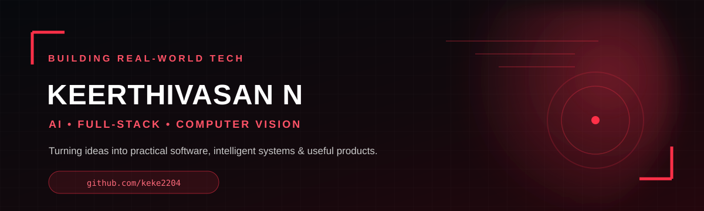

<div align="center">



### AI • Full-Stack • Computer Vision

<a href="https://github.com/keke2204"></a>
<a href="mailto:keerthivasan2220@gmail.com"></a>

</div>

---

## 👋 Hey, I'm Keerthivasan

I'm a developer who enjoys turning ambitious ideas into **practical software, AI-powered tools, and useful products**.

My recent work spans **AI agents, computer vision, full-stack web applications, image analysis, browser automation, and developer tooling**. I like building projects that solve a real problem rather than stopping at a demo.

> **Build it. Test it. Learn from it. Make it better.**

---

## ⚡ What I'm Building

- 🤖 **AI systems & agents** — practical AI workflows and review systems
- 🧠 **Computer vision** — image analysis, similarity, manipulation detection and verification
- 🌐 **Full-stack products** — React/Vite frontends with Python/FastAPI backends
- 🛡️ **Digital identity protection** — defensive tools for detecting and responding to media misuse
- 🧪 **Developer experiments** — turning ideas into working prototypes and deployable products

---

## 🧰 Tech Stack

### Languages
<p>

</p>

### Frontend & Backend
<p>

</p>

### AI / Data / Computer Vision
<p>

</p>

**Also working with:** ChromaDB · SQLite · SQLAlchemy · NumPy · Pandas · Sentence Transformers · Groq/OpenAI-compatible APIs · Playwright

### Cloud & Tools
<p>

</p>

---

## 🚀 Featured Projects

<table>
<tr>
<td width="50%">

### 🧠 Precedent
**AI review agent that learns from corrected mistakes.**

Uses retrieval over previous human corrections so similar future inputs can benefit from what the system learned — without model fine-tuning.

**Stack:** FastAPI · React · ChromaDB · SQLite · Groq · Cloudflare

<a href="https://github.com/keke2204/PRECEDENT">Repository</a> · <a href="https://precedent-review.precedent-review.workers.dev">Live Demo</a>

</td>
<td width="50%">

### 🛡️ VeriSelf
**Digital identity defense for the non-famous.**

A defensive workflow combining image analysis, similarity matching, manipulation detection, public-web monitoring, evidence collection and response guidance.

**Stack:** React · Vite · Tailwind · FastAPI · OpenCV · Playwright

<a href="https://github.com/keke2204/VERISELF">Repository</a> · <a href="https://keke2204.github.io/VERISELF/">Live Demo</a>

</td>
</tr>

<tr>
<td width="50%">

### 👥 ASK TEAM
**AI/ML-focused identity protection platform.**

A full-stack project combining web engineering, computer vision, machine learning and defensive digital-identity workflows.

**Stack:** JavaScript · Python · FastAPI · OpenCV · SQLite · Playwright

<a href="https://github.com/keke2204/ASK-TEAM">Repository</a>

</td>
<td width="50%">

### 😂 KEKE MEME CAPTION
**Zero-key meme caption studio.**

A browser-first meme captioning application where rendering and downloading happen locally without requiring an API key.

**Stack:** React · Vite · TypeScript · Canvas · GitHub Pages

<a href="https://github.com/keke2204/KEKE_MEME_CAPTION">Repository</a> · <a href="https://keke2204.github.io/KEKE_MEME_CAPTION/">Live Demo</a>

</td>
</tr>

<tr>
<td width="50%">

### 🎤 AI Interview Coach
**AI-powered interview practice project.**

A focused project for experimenting with AI-assisted interview preparation and coaching workflows.

<a href="https://github.com/keke2204/AI-INTERVIEW-COACH">Repository</a>

</td>
<td width="50%">

### 🔬 More in progress...
I'm continuously experimenting with new AI, full-stack and computer-vision ideas.

<a href="https://github.com/keke2204?tab=repositories">Explore all repositories →</a>

</td>
</tr>
</table>

---

## 📊 GitHub

<div align="center">


<br/>


</div>

---

## 🧩 How I Like to Build

```text
IDEA
  ↓
Prototype
  ↓
Build the real workflow
  ↓
Test with actual inputs
  ↓
Find what breaks
  ↓
Improve
  ↓
Ship 🚀
```

I care about **useful UX, honest limitations, reproducible systems, and shipping working software**.

---

## 🌱 Currently Exploring

- Generative AI & AI agents
- Retrieval-augmented systems
- Computer vision & multimodal applications
- Full-stack architecture
- Browser automation
- Cloud deployment
- Better developer experiences

---

## 🤝 Let's Connect

<div align="center">

<a href="https://github.com/keke2204">

</a>
<a href="mailto:keerthivasan2220@gmail.com">

</a>

<br/><br/>

**Interested in AI, full-stack products, computer vision, or building something useful?**

</div>

---

<div align="center">

### "Ideas are cheap. Working software is the proof."


</div>
